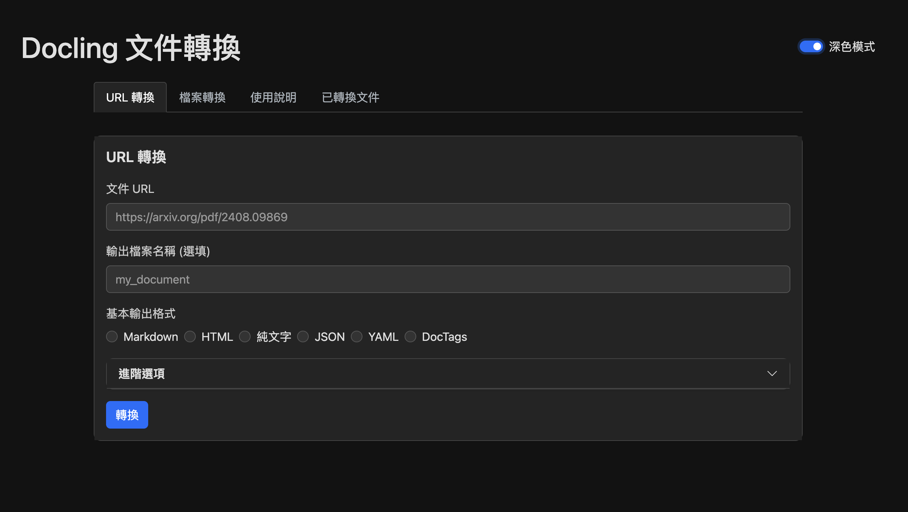
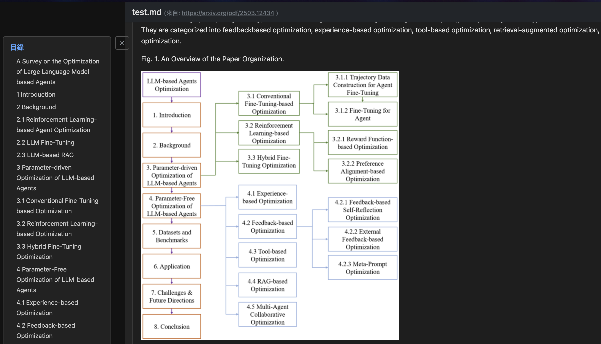

# Docling Web - 文件轉換 Web 應用程式

這是一個使用 FastAPI 和 [Docling](https://github.com/docling-project/docling) 核心庫建立的 Web 應用程式，用於轉換各種文件格式，將轉換功能依簡單的前端顯示與下載，可應用於 LLM、報告呈現、筆記使用

Docling 是一個功能強大的文件轉換系統，可將各種格式的文件（如 PDF、Word、HTML 等）轉換為 Markdown、JSON、YAML、HTML 或純文字格式。系統提供直觀的網頁介面，支援多種轉換模式和文件處理選項

## 前端畫面
| 初始畫面     | 檢視文件   |
| ----------- | -------------|
|| |

操作畫面


## 功能

*   上傳本地檔案進行轉換
*   透過 URL 轉換遠端檔案 (背景處理)
*   批量上傳多個檔案進行轉換
*   支援多種輸入格式 (PDF, DOCX, HTML, PPTX, 圖像等，依 Docling 設定)
*   支援多種輸出格式 (Markdown, JSON, YAML, HTML, Text, DocTags)
*   可設定轉換選項，包括：
    *   圖片匯出模式 (內嵌、引用、佔位符)
    *   PDF 處理管道 (Standard, VLM)
    *   OCR 啟用/強制、引擎、語言
    *   PDF 後端選擇
    *   表格處理模式
    *   內容豐富化選項 (程式碼、公式(此功能還不完善，不建議使用))
    *   硬體加速選項
*   查看已轉換的文件
*   管理轉換任務 (查看進度、詳細資訊、刪除記錄)
*   提供 API 端點以程式化方式進行交互

## 使用技術

*   **後端框架:** FastAPI
*   **文件轉換核心:** Docling
*   **模板引擎:** Jinja2
*   **前端:** (基礎 HTML/CSS/JavaScript，透過 Jinja2 渲染)

## 專案結構

```
docling_web/
├── app.py              # 主應用程式入口 (FastAPI 初始化, 掛載路由)
├── config.py           # 應用程式設定 (路徑, 全域狀態(待改進), 預設選項)
├── models.py           # Pydantic 資料模型 (請求/回應模型, 選項)
├── requirements.txt    # Python 依賴列表
├── services/           # 業務邏輯層
│   ├── __init__.py
│   ├── conversion_service.py # 轉換器建立, 轉換執行, URL處理任務
│   ├── file_service.py     # 檔案儲存, 路徑處理, 元數據儲存, 文件匯出
│   ├── image_service.py    # Markdown/HTML 圖片處理
│   └── progress_service.py # 任務進度更新
├── routers/            # API 路由層 (端點定義)
│   ├── __init__.py
│   ├── conversion.py     # 轉換相關路由 (/api/convert-url, /api/batch-convert)
│   ├── documents.py      # 文件查看/列表路由 (/documents, /view/{filename})
│   ├── misc.py           # 其他路由 (/, /progress, /api/options, /version, /output, /tasks page, /batch-convert page)
│   └── tasks.py          # 任務管理 API 路由 (/api/tasks)
├── templates/          # Jinja2 HTML 模板
│   ├── index.html
│   ├── view.html
│   ├── batch_convert.html
│   └── tasks.html
├── static/             # 靜態檔案 (CSS, JS, 圖片)
│   └── images/           # 儲存匯出的圖片 (如果使用 'referenced' 模式)
├── output/             # 儲存轉換後的輸出文件
├── uploads/            # 儲存上傳的原始檔案
└── README.md           # 本文件
```

## 設定與執行

### 源碼安裝
1. **安裝 python 相關環境:**
    
    這裡推薦使用 [uv](https://github.com/astral-sh/uv) 進行安裝
    ```bash
    uv venv -p 3.12 # 安裝 python 3.12
    # MacOS
    source .venv/bin/activate # 進入虛擬環境
    # Windows
    .venv/Script/activate
    ```
2.  **安裝依賴:**
    ```bash
    uv pip install -r requirements.txt 
    # 注意: Docling 及其相關模型 (如 OCR) 可能需要額外的系統依賴或設定
    # 請參考 Docling 的官方文件進行安裝。
    ```

3.  **執行應用程式:**
    ```bash
    python app.py
    ```

4.  **訪問應用:**
    在瀏覽器中開啟 `http://localhost:8000`

### docker-compose
1. 安裝 Docker
```bash
curl -sSL https://get.docker.com/ | sh
```
2. 在此目錄執行 docker compose
```bash
docker compose up -d
```
3. 在瀏覽器中開啟 `http://localhost:33033` 


## API 端點

應用程式提供以下主要 API 端點 (詳見 `routers/` 目錄下的程式碼):

*   `POST /api/convert-file`: 上傳單一檔案進行轉換。
*   `GET /api/convert-url`: 提供 URL 進行背景轉換。
*   `POST /api/batch-convert`: 上傳多個檔案進行批量轉換。
*   `GET /documents`: 列出已轉換的文件。
*   `GET /view/{filename}`: (HTML) 查看已轉換的文件內容。
*   `GET /output/{filename}`: 下載已轉換的文件。
*   `GET /progress/{task_id}`: 獲取特定任務的進度。
*   `GET /api/tasks`: 列出所有批次任務記錄。
*   `GET /api/tasks/{task_id}`: 獲取特定批次任務的詳細資訊。
*   `DELETE /api/tasks/{task_id}`: 刪除特定批次任務記錄。
*   `GET /api/ocr-engines`: 獲取可用的 OCR 引擎。
*   `GET /api/conversion-options`: 獲取可用的轉換選項。
*   `GET /version`: 獲取應用程式及 Docling 版本資訊。

## 待辦事項與改進

*   **狀態管理:** 將 `CONVERSION_PROGRESS` 和 `ACTIVE_BATCH_TASKS` 從全域字典改為使用資料庫 (如 SQLite, Redis) 或任務佇列 (如 Celery) 進行管理，以支援擴展性和並發請求。
*   **錯誤處理:** 增強服務和路由中的錯誤處理與日誌記錄。
*   **測試:** 新增單元測試和整合測試。
*   **前端:** 改善前端使用者介面和使用者體驗。
*   **設定:** 將可配置項 (如 host, port, Docling 選項預設值) 移至設定檔或環境變數。
*   **依賴注入:** 更一致地使用 FastAPI 的依賴注入系統 (例如：共享 `templates` 實例)。
